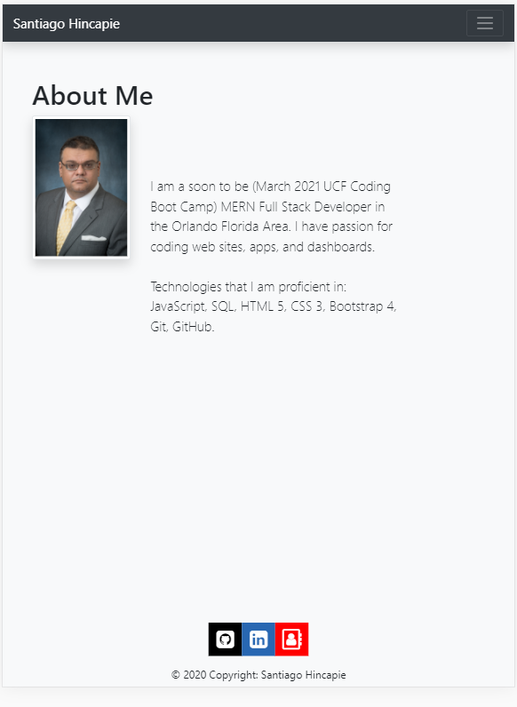
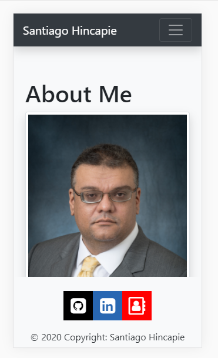
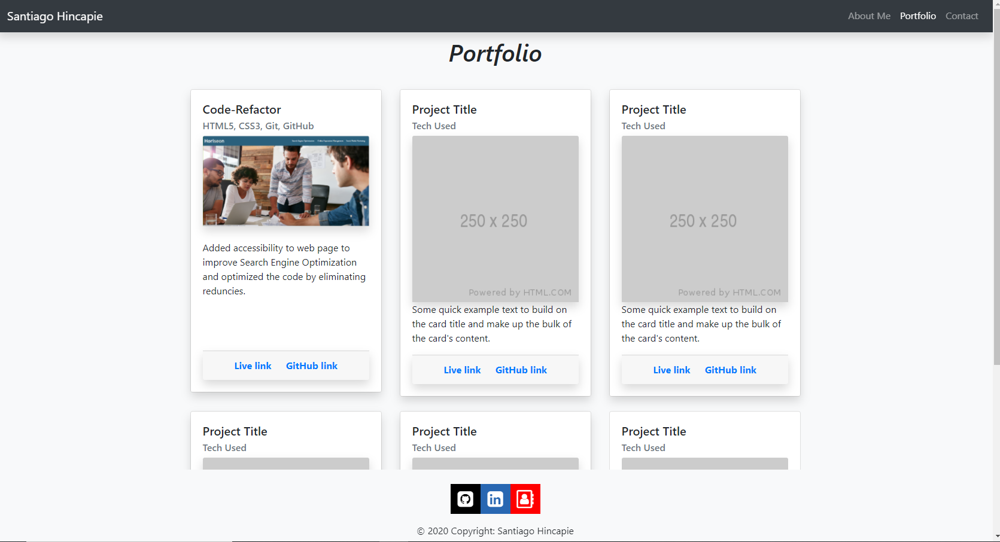
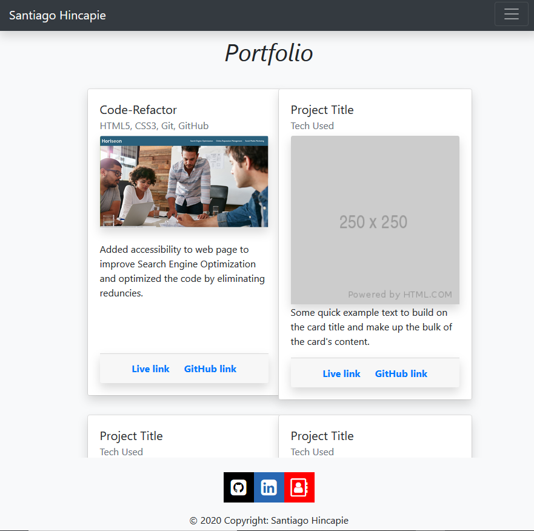
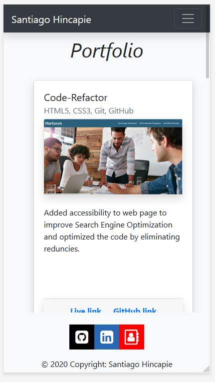
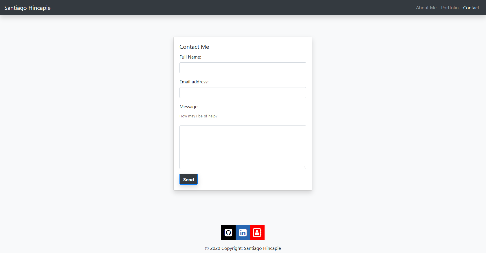
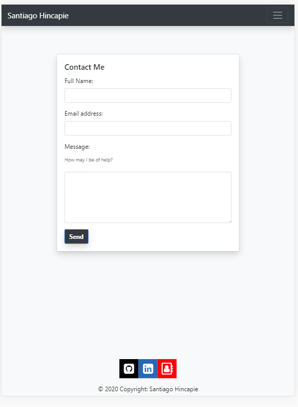
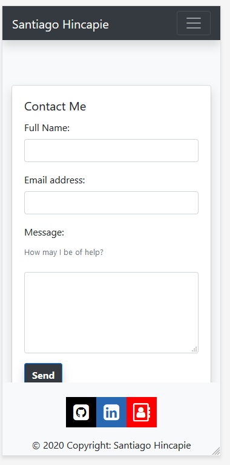

# 02-CSS-and-Bootstrap-Homework-Responsive-Portfolio

# Created by Santiago Hincapie 

# Updated on 9/26/2020

# Page layout

Contains three pages; About Me, Portfolio, and Contact pages.

# About Me (Desktop Imange)

# About Me (Tablet Imange)

# About Me (Phone Imange)

# Portfolio (Desktop Imange)

# Portfolio (Tablet Imange)

# Portfolio (Phone Imange)

# Contact (Descktop Imange)

# Contact (Tablet Imange)

# Contact (Phone Imange)

